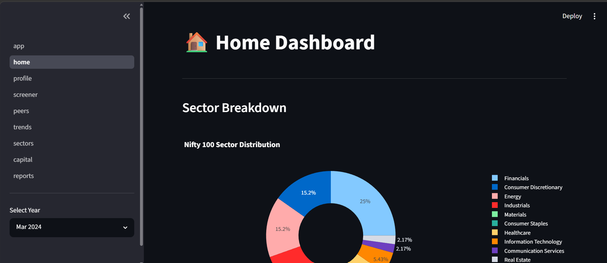
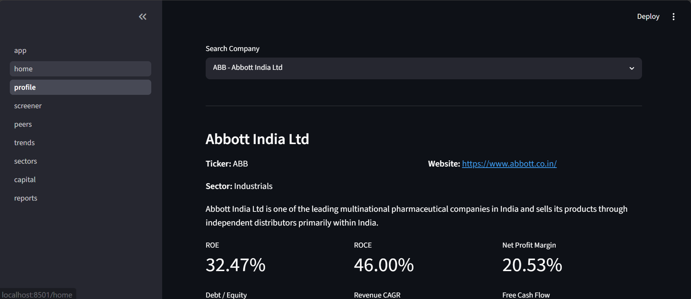
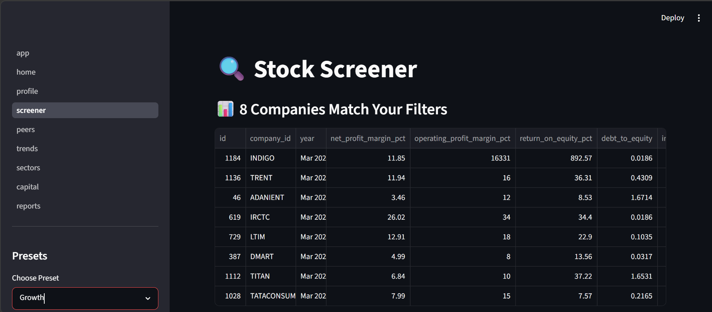
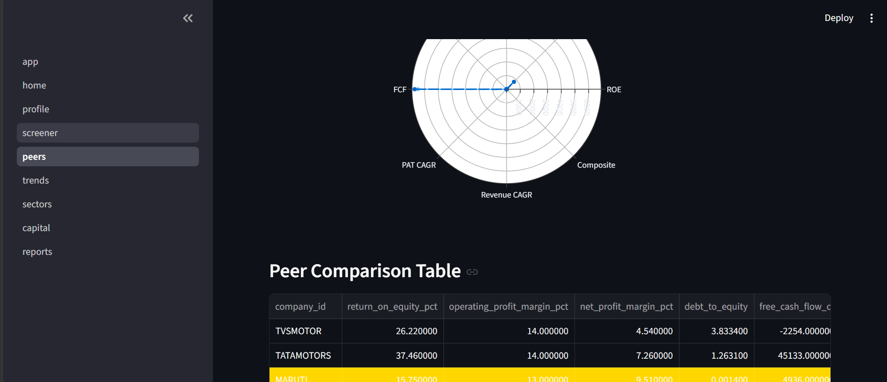
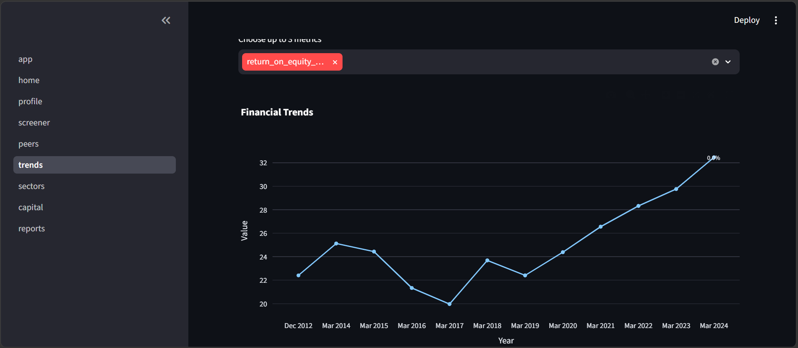
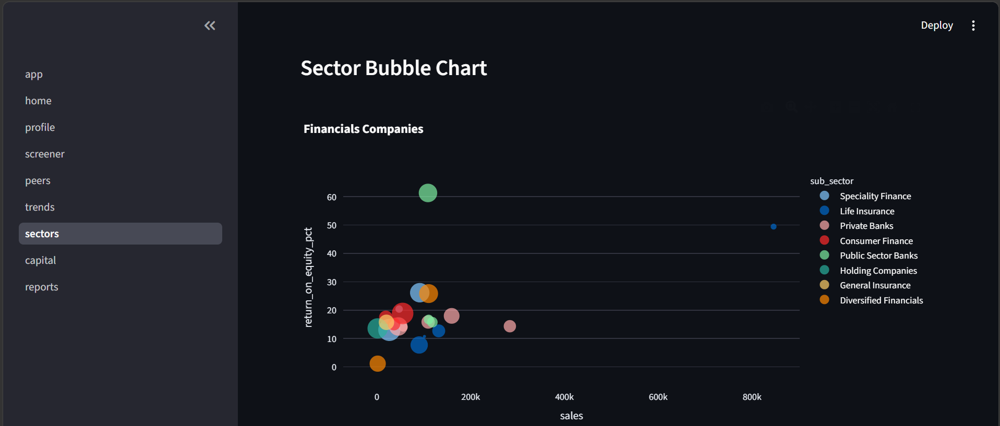
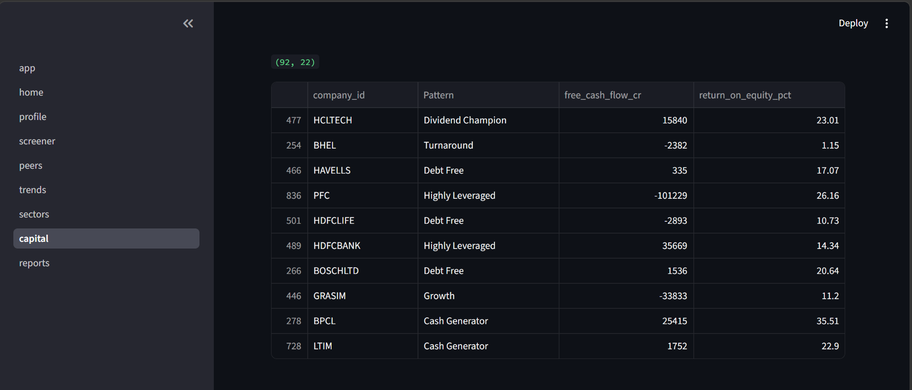
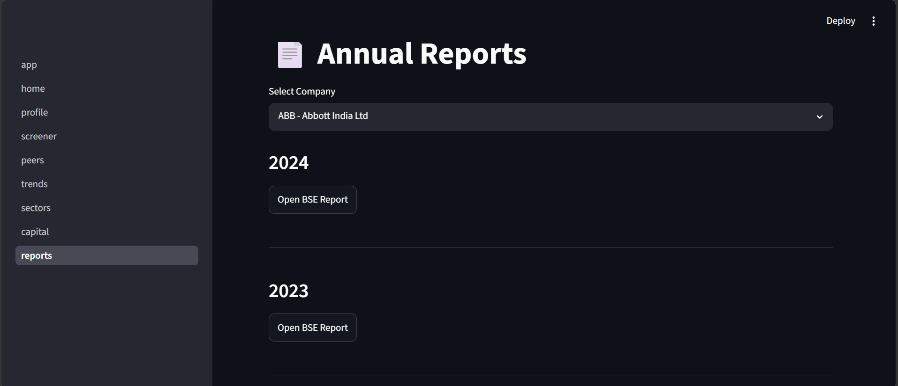

# Nifty100 Financial Intelligence Platform

Sprint 1 – Data Foundation

## Project Overview

Building a validated SQLite database from 12 financial datasets covering Nifty100 companies.

## Sprint 1 Deliverables

- ETL Pipeline
- SQLite Database
- Data Validation Rules
- Load Audit Report
- Unit Tests

## Tech Stack

- Python
- Pandas
- SQLite
- SQLAlchemy
- Pytest

# Verification Utilities

These scripts were created during Sprint 2 development to validate the Financial Ratio Engine.

They were used for:
- Database schema inspection
- Source table verification
- Financial ratio validation
- CAGR validation
- Manual spot checks
- Row count verification
- Database population verification

These scripts are development utilities and are not required to run the main application.

## Dashboard

### Run the Streamlit Dashboard

1. Clone the repository

```bash
git clone https://github.com/vanshtomar760-hue/nifty100-financial-intelligence-platform.git
```

2. Navigate to the project

```bash
cd nifty100-financial-intelligence-platform
```

3. Install dependencies

```bash
pip install -r requirements.txt
```

4. Launch the dashboard

```bash
streamlit run src/dashboard/app.py
```

The application will open in your browser at:

```
http://localhost:8501
```

## Dashboard Features

### 🏠 Home
- Overall market KPIs
- Sector distribution
- Top performing companies
- Interactive year selection

### 🏢 Company Profile
- Company overview
- Financial KPIs
- Revenue and Profit trends
- ROE and ROCE comparison
- Pros & Cons

### 🔍 Screener
- Interactive financial filters
- Custom stock screening
- Export screened companies

### 👥 Peer Comparison
- Compare companies within peer groups
- Radar chart visualization
- KPI comparison table
- Benchmark highlighting

### 📈 Trend Analysis
- Multi-metric historical analysis
- Interactive Plotly charts
- Year-over-Year growth insights

### 🏭 Sector Analysis
- Sector-wise comparison
- Bubble chart visualization
- Sector median KPI analysis

### 🌳 Capital Allocation Map
- Capital allocation pattern classification
- Treemap visualization
- Pattern-wise company listing

### 📄 Annual Reports
- Company report search
- Year-wise annual report links
- Direct access to BSE filings










## Sprint 4 Retrospective

### UX Decisions
- Designed a clean multi-page Streamlit dashboard with intuitive sidebar navigation.
- Used Plotly interactive visualizations to improve data exploration.
- Implemented responsive charts using `use_container_width=True` for better viewing across screen sizes.
- Added informative messages and graceful handling for incomplete historical data and missing financial metrics.

### Data Edge Cases
- Some companies contained limited historical financial records, so the dashboard displays available data without errors.
- Missing KPI values are shown as **"N/A"** instead of causing application failures.
- Valuation metrics handle missing P/E ratios and sector medians safely.
- Screener functionality was tested with extreme filter values to ensure stable behavior.

### Performance Findings
- Optimized SQL queries to retrieve only required records.
- Company Profile pages consistently loaded in under 3 seconds during testing.
- Plotly charts rendered efficiently with no noticeable UI lag.
- End-to-end testing confirmed stable performance across all eight dashboard modules.

## Sprint 4 Progress

- [x] Dashboard Home
- [x] Company Profile
- [x] Screener
- [x] Peer Comparison
- [x] Trend Analysis
- [x] Sector Analysis
- [x] Capital Allocation
- [x] Annual Reports
- [x] Valuation Module
- [x] Integration QA
- [x] Documentation

